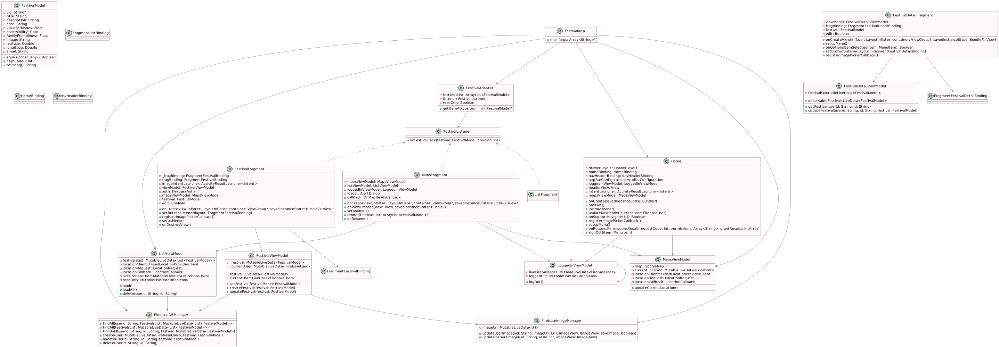

# My Festival App

My Festival App is a mobile application designed to help users discover and manage their favorite festivals. The app allows users to create, edit, and view festival details, such as event name, date, location, and user ratings. It also integrates with Google Maps to provide users with the ability to locate festivals on the map.

## Functionality

### Key Features

- **Festival Management**: Users can create and manage festival entries, including festival name, description, date, location, and user ratings.

- **Google Maps Integration**: The app incorporates Google Maps to display festival locations on the map, making it easy for users to find events.

- **User Authentication**: Users can log in using their Google accounts, ensuring secure access to their festival data.

### Additional Features

- **Image Upload**: Users can upload images for festivals to make them more visually appealing.

- **Toggle View**: Users can switch between viewing all festivals or only their festivals, providing a personalized experience.

- **Swipe Gestures**: The app supports swipe gestures for editing and deleting festivals, enhancing user convenience.

## Google APIs

- **Google Maps API**: The Google Maps API is used to display festival locations on the map and provide location-based services.

- **Firebase Authentication**: Firebase Authentication is used to enable user authentication through Google accounts.

## UX/DX Approach

### User Experience (UX)

The primary focus in designing My Festival App was to create an intuitive and user-friendly experience. Key UX considerations include:

- **User-Friendly Interface**: A clean and straightforward user interface was designed to ensure that users can easily navigate and interact with the app.

- **Visual Appeal**: Users can upload images for festivals, making the app visually appealing and enhancing the festival discovery experience.

- **Google Maps Integration**: By integrating Google Maps, users can effortlessly locate festivals, enhancing the overall user experience.

### Developer Experience (DX)

We aimed to simplify the development process for contributors and maintainers. Key DX considerations include:

- **Modular Architecture**: The project follows a modular architecture for clean and organised code.

- **Code Quality**: The project adheres to best coding practices and follows a consistent coding style, ensuring maintainability and readability.

## References/Acknowledgemnents

 The following libraries and tools for making this project possible:

- [Firebase](https://firebase.google.com/)
- [Picasso](https://square.github.io/picasso/)
- Android Developer Documentation
- Placemark and DonationX case studies

---
## Class Diagram

